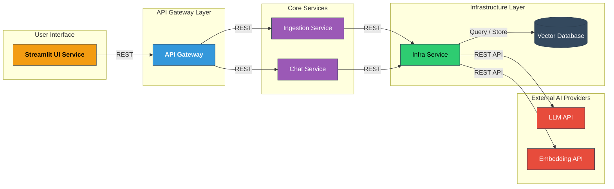

# Finance Expense Tracker (FinExp) | Agentic Microservices Architecture

<p align="center">
  
  
  
  
  <br/>
  
  
  
  
</p>

A production-oriented, AI-powered financial intelligence system for tracking, analyzing, and retrieving personal expense data.

Built around **Agentic Orchestration**, **Hybrid RAG pipelines**, and **persistent semantic memory**, the system enables intelligent financial understanding beyond traditional expense trackers.

---

## 🏗 System Architecture



---

## 🛠 Microservices Breakdown

| Service | Pattern | Responsibility | Port |
| :--- | :--- | :--- | :--- |
| **API Gateway** | Hexagonal | Central entry point; orchestrates communication between nodes. | 8000 |
| **Chat Service** | Agentic RAG | Executes RAG workflows and manages financial query intent. | 8001 |
| **Ingestion Service** | Event-Driven | Processes raw PDFs; handles cleaning and metadata enrichment. | 8002 |
| **Infra Service** | Resource Adapter | Manages LLM providers, Embedding models, and VectorDB logic. | 8003 |
| **UI Service** | Modular Frontend | Streamlit dashboard for data visualization and chat. | 8501 |

---

## 🚀 Setup & Execution Guide

### 1. Environment Preparation
Choose your preferred environment manager. **Python 3.11** is strictly required.

#### Option A: Using Venv (Standard)
```bash
# Create and activate environment
python -m venv venv
source venv/bin/activate  # Linux/macOS
# or: venv\Scripts\activate  # Windows

# Install dependencies
pip install --upgrade pip
pip install -r requirements.txt
```

#### Option B: Using Conda (Recommended)
```bash
# Create and activate environment
conda create -n finexp python=3.11 -y
conda activate finexp

# Install dependencies
pip install -r requirements.txt
```

### 2. Service Execution Protocol
All backend services **must** be launched from the project root directory. Open a separate terminal for each service:

```bash
# Terminal 1: Infrastructure Layer
uvicorn source.infra_service.main:app --port 8003

# Terminal 2: Ingestion Pipeline
uvicorn source.ingestion_service.main:app --port 8002

# Terminal 3: Chat Logic
uvicorn source.chat_service.main:app --port 8001

# Terminal 4: API Gateway
uvicorn source.api_gateway.main:app --port 8000

# Terminal 5: User Interface
cd source/ui_service && streamlit run app.py
```

---

## 🔍 Core Components & Logic

### 1. Hybrid RAG Pipeline
The system utilizes a dual-retrieval strategy to ensure financial accuracy:
* **Dense Retrieval:** Captures semantic meaning of expenses.
* **Keyword Matching (BM25):** Ensures exact matches for merchant names and IDs.

### 2. Agentic Orchestration
The `chat_service` utilizes a graph-based state machine to classify intent, retrieve context, and self-correct responses based on retrieved financial data.

---

## 📂 Project Structure

```bash
.
├── source/                  # Microservices Implementation
│   ├── api_gateway/         # Central Router & Security
│   ├── chat_service/        # LangGraph RAG Workflows
│   ├── ingestion_service/   # Data Processing Pipelines
│   ├── infra_service/       # VectorDB & LLM Connectors
│   └── ui_service/          # Streamlit Interface (app.py)
├── data/                    # Storage for raw documents
├── requirements.txt         # Global dependencies
└── config.yaml              # System-wide parameters
```

---

## ⚙️ Environment Configuration

Each microservice is fully isolated and maintains its own environment configuration.

There is no shared or global `.env` file across the system.

---

### 📦 Service-Level Setup

Each microservice includes its own `.env.example` file:

- `source/api_gateway/.env.example`
- `source/chat_service/.env.example`
- `source/ingestion_service/.env.example`
- `source/infra_service/.env.example`
- `source/ui_service/.env.example`

---

### 🔧 How to Configure

For each service, create a local `.env` file by copying its example:

```bash
cp .env.example .env
```

---

## 🙏 Acknowledgements

Special thanks to **[Eng. Baraa](https://www.linkedin.com/in/baraasallout/)** for his continuous support, guidance, and dedication.  
Deep appreciation for the time, effort, and knowledge he invested throughout this journey.

Gratitude is also extended to the **DEPI Scholarship Program** for the opportunity and support.

Appreciation to **[Abu Bakr Soliman](https://www.linkedin.com/in/bakrianoo/)** for the valuable courses and educational content.
